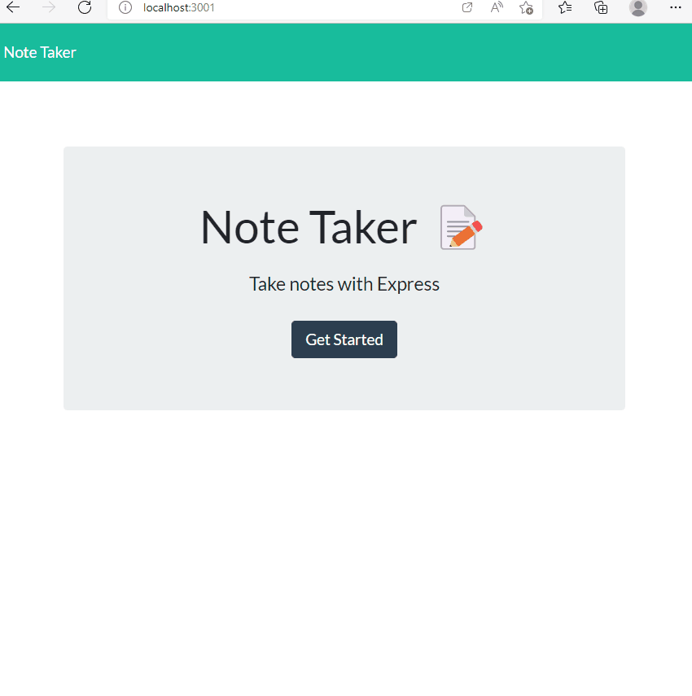

# Note-Taker

## Description

Want to create notes? This web application will have you input a note and save the notes. While being able to create and save a note you are also capable of deleting by clicking the trash can icon.  

Deployed site: https://note-hw-taker.herokuapp.com/

## Table of Contents

 * [Installation](#installation)
 * [Usage](#usage)
 * [License](#license)
 * [Badges](#badges)
 * [Questions](#questions)
 

 ## Installation 

 1. Clone repo. https://github.com/lzvalentin/Note-Taker
 2. `npm i`


 ## Usage 
 ```
AS A small business owner
I WANT to be able to write and save notes
SO THAT I can organize my thoughts and keep track of tasks I need to complete
```

```
GIVEN a note-taking application
WHEN I open the Note Taker
THEN I am presented with a landing page with a link to a notes page
WHEN I click on the link to the notes page
THEN I am presented with a page with existing notes listed in the left-hand column, plus empty fields to enter a new note title and the note’s text in the right-hand column
WHEN I enter a new note title and the note’s text
THEN a Save icon appears in the navigation at the top of the page
WHEN I click on the Save icon
THEN the new note I have entered is saved and appears in the left-hand column with the other existing notes
WHEN I click on an existing note in the list in the left-hand column
THEN that note appears in the right-hand column
WHEN I click on the Write icon in the navigation at the top of the page
THEN I am presented with empty fields to enter a new note title and the note’s text in the right-hand column
```

## License

None.

## Badges


## Questions
Reach out to me through [Github](www.github.com/lzvalentin) .